# vLLM Internals Architecture Guide

This document provides a deep dive into vLLM's architecture for implementers. It covers ownership hierarchies, data flow, and the nitty-gritty details of each component.

## Table of Contents

1. [High-Level Architecture](#1-high-level-architecture)
2. [Entry Points](#2-entry-points)
3. [Engine Core](#3-engine-core)
4. [Executor & Worker Hierarchy](#4-executor--worker-hierarchy)
5. [Model Loading & Execution](#5-model-loading--execution)
6. [Attention Backends](#6-attention-backends)
7. [KV Cache & Memory Management](#7-kv-cache--memory-management)
8. [Distributed Parallelism](#8-distributed-parallelism)
9. [Request Lifecycle](#9-request-lifecycle)
10. [Key Data Structures](#10-key-data-structures)

---

## 1. High-Level Architecture

### Ownership Hierarchy

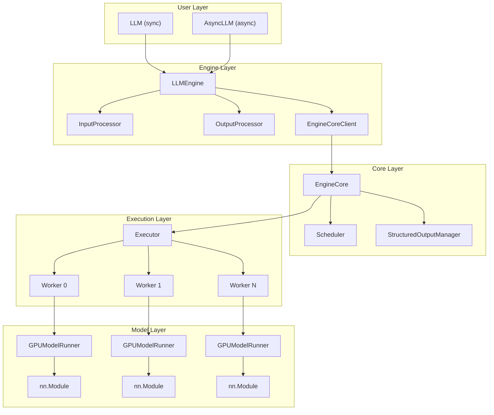

### Key Design Principles

1. **Separation of Concerns**: Input processing, scheduling, execution, and output processing are distinct layers
2. **Pluggable Backends**: Attention, execution, and communication backends are swappable
3. **Config Flows Down**: `VllmConfig` propagates from engine → executor → worker → model runner
4. **State Flows Up**: Execution results propagate upward through the hierarchy

---

## 2. Entry Points

### File Locations
- `vllm/entrypoints/llm.py` - `LLM` class
- `vllm/v1/engine/llm_engine.py` - `LLMEngine`
- `vllm/v1/engine/async_llm.py` - `AsyncLLM`

### LLM Class (Synchronous)

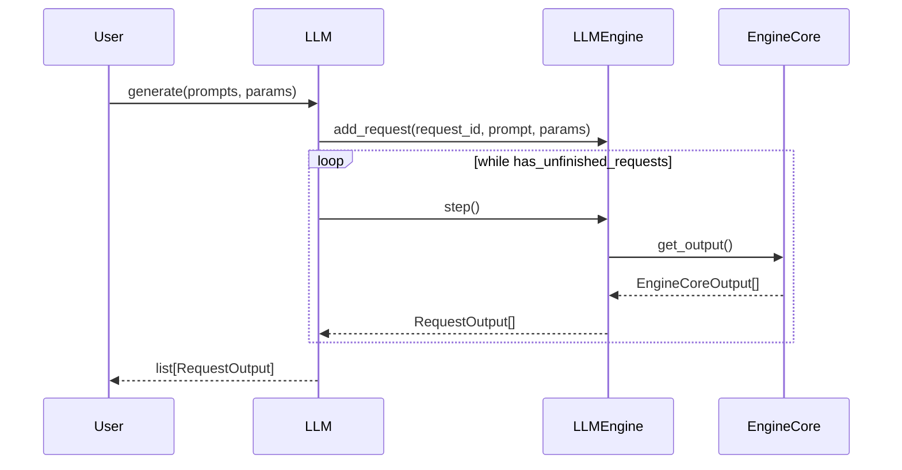

**Key Responsibilities**:
- Creates and owns a single `LLMEngine` instance
- Manages request counter for unique IDs
- Provides synchronous polling loop via `_run_engine()`

### AsyncLLM Class (Asynchronous)

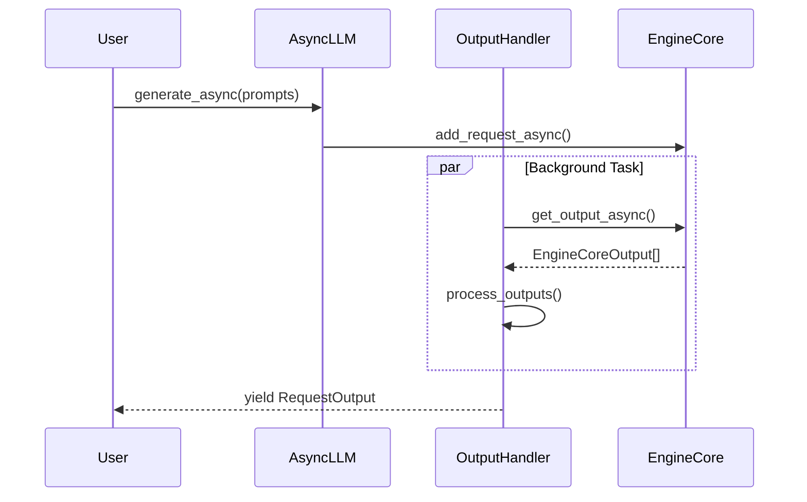

**Key Differences from LLM**:
- Background `output_handler` task continuously polls EngineCore
- Uses `RequestOutputCollector` for per-request result aggregation
- ZMQ-based IPC when using multiprocessing client

---

## 3. Engine Core

### File Location
- `vllm/v1/engine/core.py`

### EngineCore Architecture

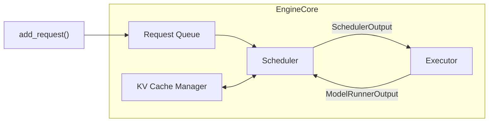

### Main Step Loop

```python
def step(self) -> list[EngineCoreOutput]:
    # 1. Schedule requests for this step
    scheduler_output = self.scheduler.schedule(self.pending_requests)

    # 2. Execute model forward pass
    model_output = self.executor.execute_model(scheduler_output)

    # 3. Sample tokens from logits
    if model_output.logits is not None:
        model_output = self.executor.sample_tokens(model_output)

    # 4. Update request states and collect outputs
    outputs = self._process_model_outputs(model_output, scheduler_output)

    return outputs
```

### EngineCoreClient Variants

| Client | Use Case | Communication |
|--------|----------|---------------|
| `InprocClient` | Single-process, debugging | Direct function calls |
| `SyncMPClient` | Multi-process sync | ZMQ sockets |
| `AsyncMPClient` | Multi-process async | ZMQ sockets + asyncio |

---

## 4. Executor & Worker Hierarchy

### File Locations
- `vllm/v1/executor/abstract.py` - Base executor
- `vllm/v1/executor/uniproc_executor.py` - Single process
- `vllm/v1/executor/multiproc_executor.py` - Multi-process
- `vllm/v1/worker/worker_base.py` - Worker interface
- `vllm/v1/worker/gpu_worker.py` - GPU worker

### Executor Hierarchy

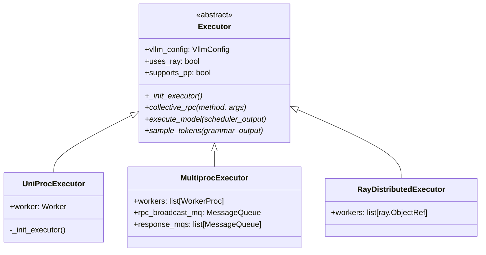

### Executor Selection Logic

```python
@staticmethod
def get_class(vllm_config: VllmConfig) -> type[Executor]:
    backend = vllm_config.parallel_config.distributed_executor_backend

    if backend == "ray":
        return RayDistributedExecutor
    elif backend == "mp":
        return MultiprocExecutor
    else:  # "uni" or None
        return UniProcExecutor
```

### Worker Architecture

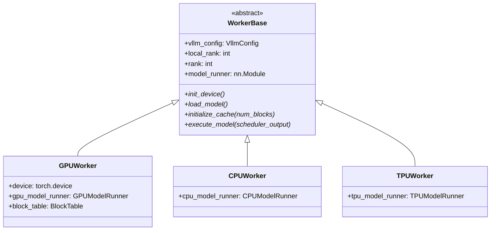

---

## 5. Model Loading & Execution

### File Locations
- `vllm/model_executor/model_loader/` - Model loaders
- `vllm/v1/worker/gpu_model_runner.py` - GPU execution

### Model Loading Flow

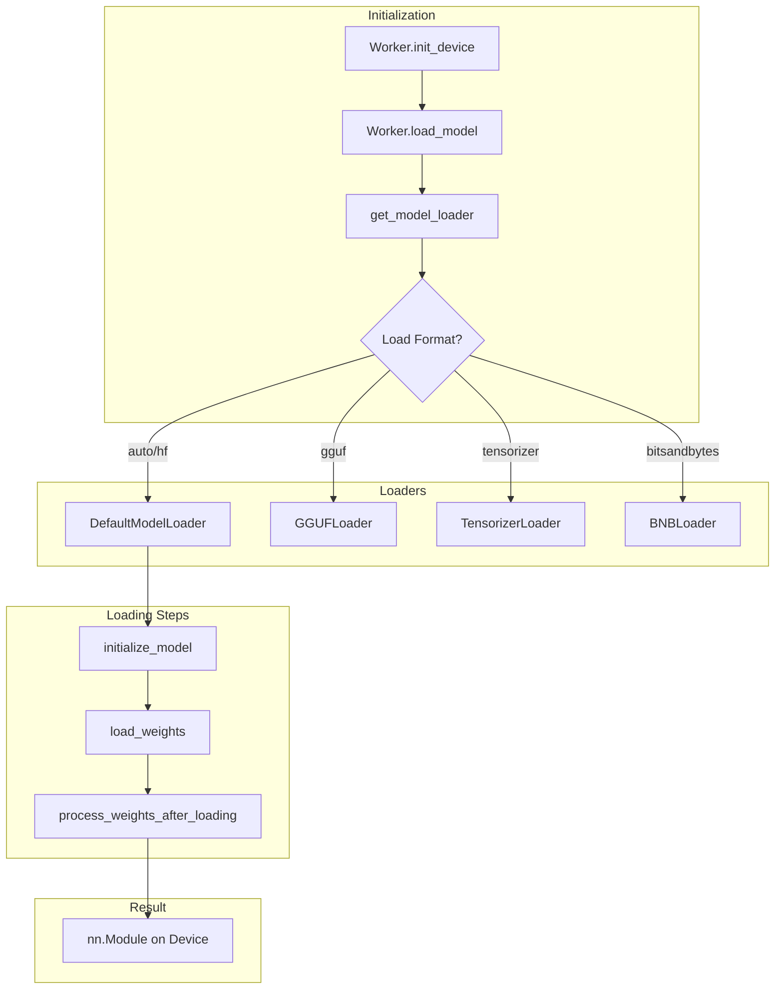

### GPUModelRunner Key Components

```python
class GPUModelRunner:
    def __init__(self, vllm_config, device):
        self.model: nn.Module                    # Loaded model
        self.kv_cache_spec: dict[str, KVCacheSpec]  # Per-layer cache specs
        self.input_buffers: InputBuffers         # Reusable GPU buffers
        self.sampler: Sampler                    # Token sampling logic
        self.cudagraph_manager: CudaGraphManager # CUDA graph optimization

    def execute_model(self, scheduler_output) -> ModelRunnerOutput:
        # 1. Prepare inputs (prefill vs decode path)
        inputs = self.prepare_inputs(scheduler_output)

        # 2. Set attention metadata in forward context
        with set_forward_context(attn_metadata, self.vllm_config):
            # 3. Run model forward
            logits = self.model(inputs)

        return ModelRunnerOutput(logits=logits)
```

---

## 6. Attention Backends

### File Locations
- `vllm/attention/layer.py` - Attention module
- `vllm/v1/attention/backend.py` - Backend abstraction
- `vllm/v1/attention/backends/` - Implementations

### Backend Selection

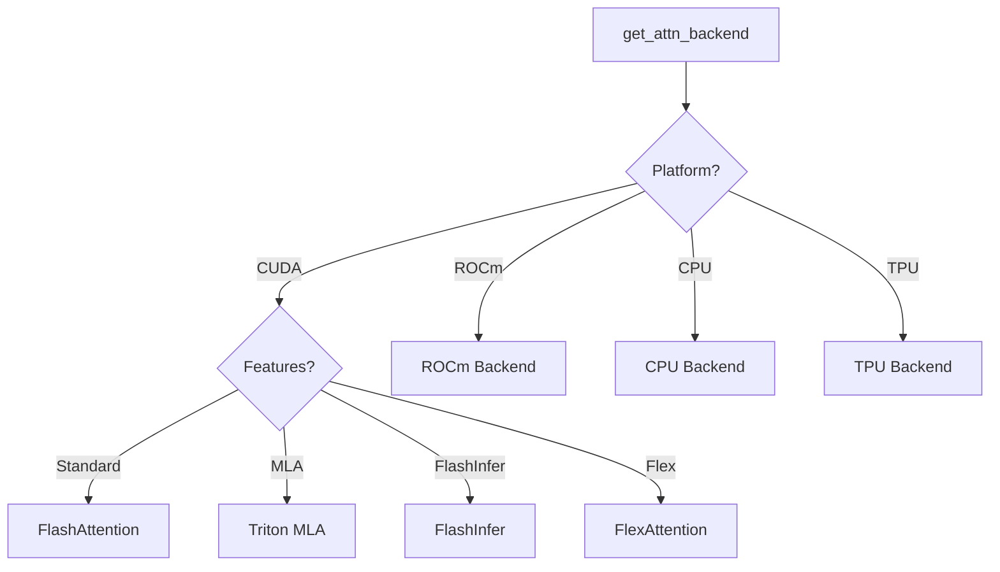

### Available Backends

| Backend | Platform | Key Features |
|---------|----------|--------------|
| `FlashAttention` | CUDA | Default, varlen, FP8 KV cache |
| `FlashInfer` | CUDA | Tree attention, paged attention |
| `TritonAttn` | CUDA/ROCm | Triton kernels |
| `ROCmAttn` | ROCm (AMD) | AMD-optimized |
| `CPUAttn` | CPU | Fallback |
| `FlexAttention` | CUDA | PyTorch 2.5+ flexible attention |
| `TritonMLA` | CUDA | Multi-Head Latent (DeepSeek-V2) |

### Attention Layer Internals

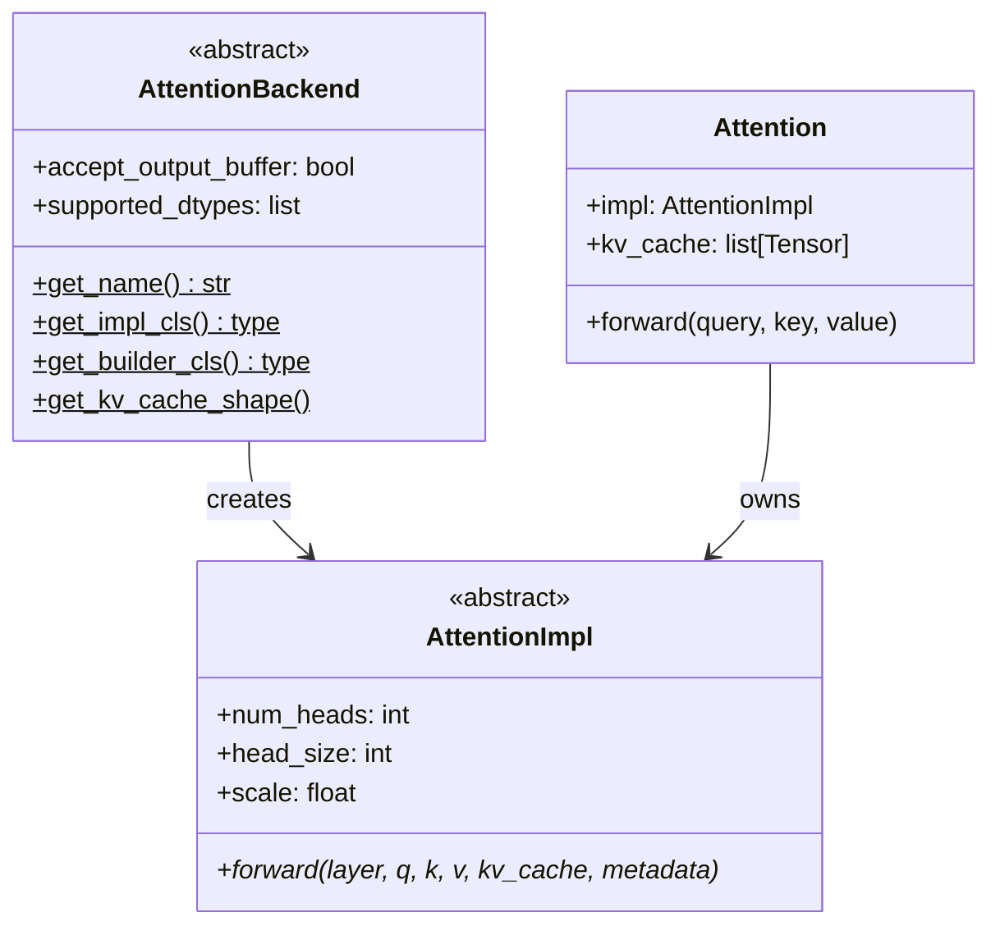

### KV Cache Layout

```
Standard Layout (FlashAttention):
  Shape: (2, num_blocks, block_size, num_kv_heads, head_size)
         │  │           │           │              └── 128 (typical)
         │  │           │           └── 8 (for GQA with 8:1 ratio)
         │  │           └── 16 tokens per block (typical)
         │  └── Variable, based on GPU memory
         └── 2 for K and V tensors

MLA Layout (Multi-Head Latent):
  Shape: (num_blocks, block_size, kv_lora_rank + qk_rope_head_dim)
         Compressed KV representation
```

---

## 7. KV Cache & Memory Management

### File Locations
- `vllm/v1/core/block_pool.py` - Block allocation
- `vllm/v1/core/kv_cache_manager.py` - High-level coordination
- `vllm/v1/core/kv_cache_utils.py` - Block hashing, utilities
- `vllm/v1/worker/block_table.py` - GPU block table

### Block Pool Architecture

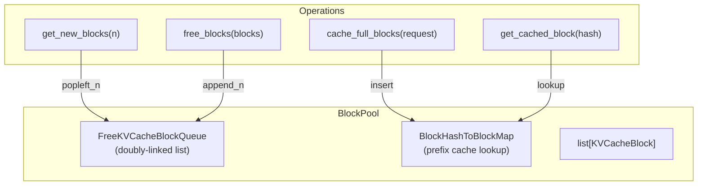

### Block State Machine

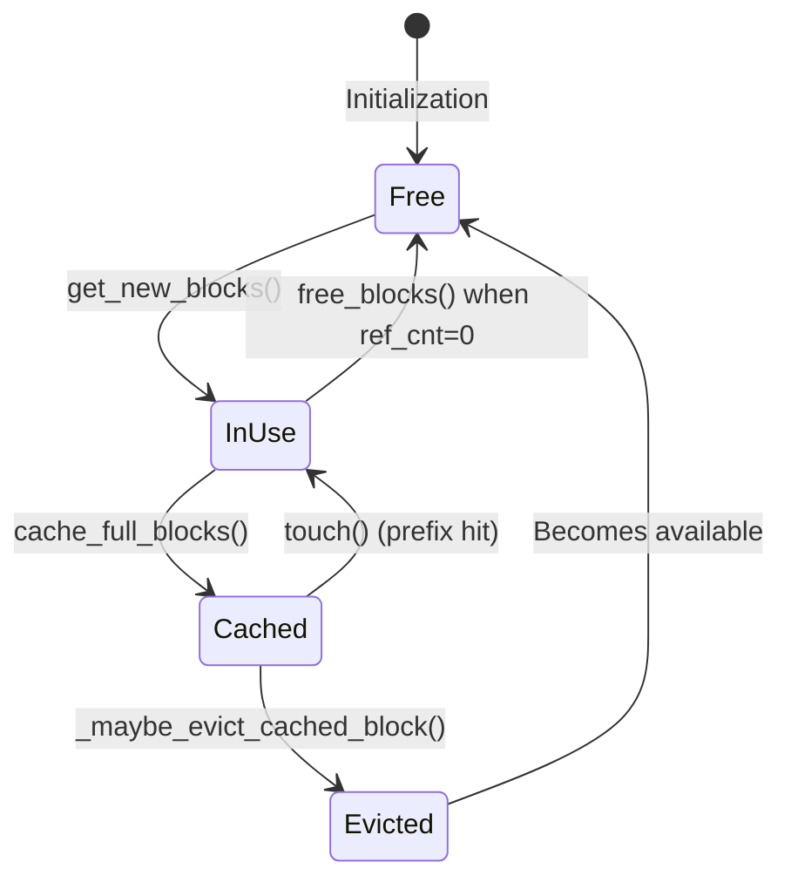

### KVCacheBlock Structure

```python
@dataclass
class KVCacheBlock:
    block_id: int              # 0 to num_gpu_blocks-1
    ref_cnt: int = 0           # Reference count (shared blocks)

    # Prefix caching
    _block_hash: BlockHashWithGroupId | None = None

    # Linked list for free queue
    prev_free_block: KVCacheBlock | None = None
    next_free_block: KVCacheBlock | None = None

    is_null: bool = False      # Placeholder block (id=0)
```

### Prefix Caching Flow

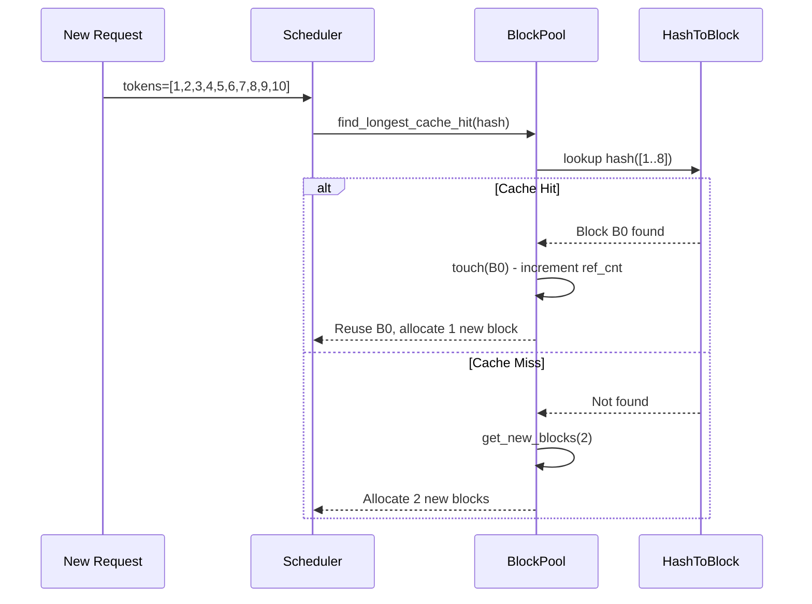

### Block Table (GPU-side)

```python
class BlockTable:
    """Maps requests to KV cache blocks on GPU."""

    block_table: CpuGpuBuffer    # [max_reqs, max_blocks_per_req]
    slot_mapping: CpuGpuBuffer   # [max_batched_tokens] -> block slots

    def append_row(self, block_ids: list[int]):
        """Add blocks for a new request."""

    def compute_slot_mapping(self, positions: Tensor):
        """Calculate token -> (block_id, offset) mapping."""
        # slot = block_table[req_idx][pos // block_size] * block_size + (pos % block_size)
```

---

## 8. Distributed Parallelism

### File Locations
- `vllm/distributed/parallel_state.py` - Group management
- `vllm/distributed/communication_op.py` - TP wrappers
- `vllm/distributed/device_communicators/` - Backend implementations

### Parallelism Types

```mermaid
graph TB
    subgraph "Tensor Parallelism (TP)"
        TP_GPU0["GPU 0<br/>hidden[:, 0:d/4]"]
        TP_GPU1["GPU 1<br/>hidden[:, d/4:d/2]"]
        TP_GPU2["GPU 2<br/>hidden[:, d/2:3d/4]"]
        TP_GPU3["GPU 3<br/>hidden[:, 3d/4:d]"]
        TP_GPU0 <-->|"all-gather/reduce-scatter"| TP_GPU1
        TP_GPU1 <-->|"all-gather/reduce-scatter"| TP_GPU2
        TP_GPU2 <-->|"all-gather/reduce-scatter"| TP_GPU3
    end

    subgraph "Pipeline Parallelism (PP)"
        PP_Stage0["Stage 0<br/>Layers 1-10"]
        PP_Stage1["Stage 1<br/>Layers 11-20"]
        PP_Stage2["Stage 2<br/>Layers 21-30"]
        PP_Stage0 -->|"activations"| PP_Stage1
        PP_Stage1 -->|"activations"| PP_Stage2
    end
```

### GroupCoordinator

The central communication orchestrator:

```python
class GroupCoordinator:
    rank: int                    # Global rank
    ranks: list[int]             # All ranks in group
    world_size: int              # Group size
    local_rank: int              # Device index
    cpu_group: ProcessGroup      # Gloo backend
    device_group: ProcessGroup   # NCCL/XCCL backend

    # Key operations
    def all_reduce(self, input_: Tensor) -> Tensor
    def all_gather(self, input_: Tensor, dim: int) -> Tensor
    def reduce_scatter(self, input_: Tensor, dim: int) -> Tensor
    def broadcast_tensor_dict(self, tensor_dict: dict, src: int) -> dict
```

### Global Process Groups

```python
# Singleton groups (set during initialization)
_WORLD: GroupCoordinator        # All processes
_TP: GroupCoordinator           # Tensor Parallel group
_PP: GroupCoordinator           # Pipeline Parallel group
_DP: GroupCoordinator           # Data Parallel group
_EP: GroupCoordinator           # Expert Parallel group
_DCP: GroupCoordinator          # Decode Context Parallel
_PCP: GroupCoordinator          # Prefill Context Parallel
```

### TP Group Layout

```
World Size = 16, TP = 4, PP = 2, DP = 2

Layout order: DP × PP × TP

DP0, PP0: [GPU  0,  1,  2,  3]  ← TP group
DP0, PP1: [GPU  4,  5,  6,  7]  ← TP group
DP1, PP0: [GPU  8,  9, 10, 11]  ← TP group
DP1, PP1: [GPU 12, 13, 14, 15]  ← TP group
```

### Communication Optimizations

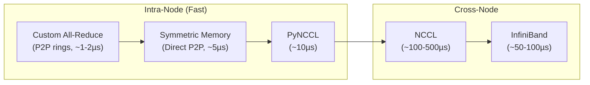

---

## 9. Request Lifecycle

### Complete Request Flow

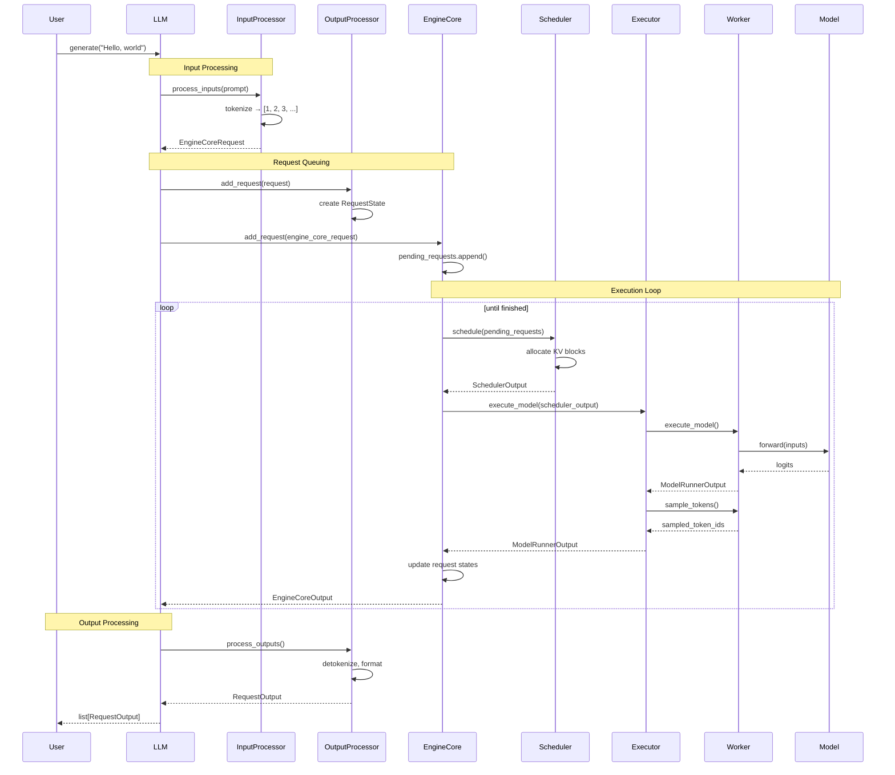

### SchedulerOutput Contents

```python
@dataclass
class SchedulerOutput:
    # Requests being processed
    scheduled_requests: list[ScheduledRequest]

    # Token/sequence information
    num_scheduled_tokens: int
    total_num_scheduled_tokens: int

    # KV cache allocation
    blocks_to_allocate: dict[str, list[int]]
    blocks_to_copy: dict[str, list[tuple[int, int]]]

    # Preemption info
    preempted_requests: list[Request]

    # Finished requests
    finished_requests: list[Request]
```

---

## 10. Key Data Structures

### EngineCoreRequest

```python
@dataclass
class EngineCoreRequest:
    request_id: str
    prompt_token_ids: list[int]
    mm_features: list[MultiModalFeatureSpec]  # Multi-modal data
    sampling_params: SamplingParams | None
    pooling_params: PoolingParams | None
    eos_token_id: int | list[int]
    arrival_time: float
    lora_request: LoRARequest | None
    data_parallel_rank: int
    priority: int
```

### Request (Internal)

```python
@dataclass
class Request:
    # From EngineCoreRequest
    request_id: str
    prompt_token_ids: list[int]
    sampling_params: SamplingParams

    # Runtime state
    status: RequestStatus  # WAITING, RUNNING, PREEMPTED, FINISHED
    _output_token_ids: list[int]  # Generated so far
    num_computed_tokens: int

    # Timing
    arrival_time: float
    first_token_time: float | None

    # KV cache blocks (managed by scheduler)
    block_ids: list[int]
```

### ModelRunnerOutput

```python
@dataclass
class ModelRunnerOutput:
    # Token sampling results
    sampled_token_ids: list[list[int]]  # [batch, n_samples]

    # Optional outputs
    logits: torch.Tensor | None
    logprobs: list[dict[int, float]] | None
    prompt_logprobs: list[dict[int, float]] | None

    # Speculative decoding
    spec_decode_outputs: SpecDecodeOutput | None
```

### RequestOutput (User-facing)

```python
@dataclass
class RequestOutput:
    request_id: str
    prompt: str | None
    prompt_token_ids: list[int]
    outputs: list[CompletionOutput]
    finished: bool

@dataclass
class CompletionOutput:
    index: int
    text: str
    token_ids: list[int]
    cumulative_logprob: float | None
    logprobs: list[dict[int, Logprob]] | None
    finish_reason: str | None  # "stop", "length", "abort"
```

---

## Appendix: Key File Reference

### Entry Points
| File | Key Classes |
|------|-------------|
| `vllm/entrypoints/llm.py` | `LLM` |
| `vllm/v1/engine/llm_engine.py` | `LLMEngine` |
| `vllm/v1/engine/async_llm.py` | `AsyncLLM` |

### Engine Core
| File | Key Classes |
|------|-------------|
| `vllm/v1/engine/core.py` | `EngineCore` |
| `vllm/v1/engine/core_client.py` | `InprocClient`, `SyncMPClient`, `AsyncMPClient` |
| `vllm/v1/engine/input_processor.py` | `InputProcessor` |
| `vllm/v1/engine/output_processor.py` | `OutputProcessor` |

### Execution
| File | Key Classes |
|------|-------------|
| `vllm/v1/executor/abstract.py` | `Executor` |
| `vllm/v1/executor/multiproc_executor.py` | `MultiprocExecutor` |
| `vllm/v1/worker/worker_base.py` | `WorkerBase` |
| `vllm/v1/worker/gpu_worker.py` | `GPUWorker` |
| `vllm/v1/worker/gpu_model_runner.py` | `GPUModelRunner` |

### Attention
| File | Key Classes |
|------|-------------|
| `vllm/attention/layer.py` | `Attention`, `MLAAttention` |
| `vllm/v1/attention/backend.py` | `AttentionBackend`, `AttentionImpl` |
| `vllm/v1/attention/backends/flash_attn.py` | `FlashAttentionBackend` |

### Memory Management
| File | Key Classes |
|------|-------------|
| `vllm/v1/core/block_pool.py` | `BlockPool`, `BlockHashToBlockMap` |
| `vllm/v1/core/kv_cache_manager.py` | `KVCacheManager` |
| `vllm/v1/core/kv_cache_utils.py` | `KVCacheBlock`, `FreeKVCacheBlockQueue` |
| `vllm/v1/worker/block_table.py` | `BlockTable` |

### Distributed
| File | Key Classes |
|------|-------------|
| `vllm/distributed/parallel_state.py` | `GroupCoordinator` |
| `vllm/distributed/communication_op.py` | TP helper functions |
| `vllm/distributed/device_communicators/` | Device-specific communicators |

### Configuration
| File | Key Classes |
|------|-------------|
| `vllm/config.py` | `VllmConfig`, `ModelConfig`, `CacheConfig`, etc. |
| `vllm/engine/arg_utils.py` | `EngineArgs` |
